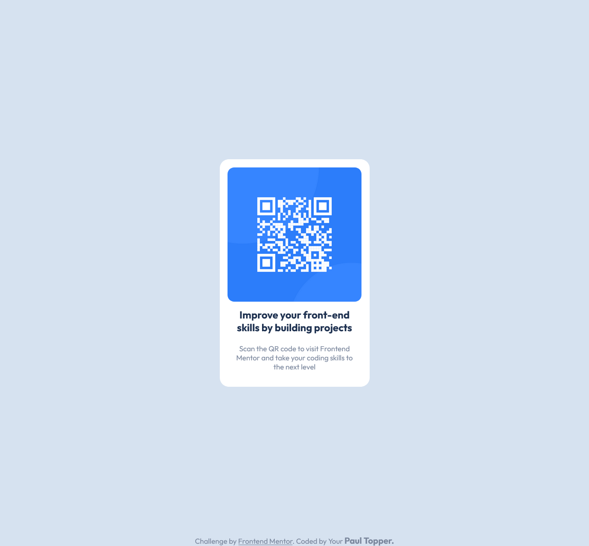

## Table of contents

- [Overview](#overview)
  - [Screenshot](#screenshot)
  - [Links](#links)
  - [Built with](#built-with)
  - [What I learned](#what-i-learned)
  - [Continued development](#continued-development)
  - [Useful resources](#useful-resources)
- [Author](#author)

## Overview

### Screenshot

### Links

- Solution URL: [Add solution URL here](https://your-solution-url.com)
- Live Site URL: [Add live site URL here](https://your-live-site-url.com)

## My process

### Built with

- Semantic HTML5 markup
- CSS 
- Flexbox
- Sass

### What I learned

i used this project to strengthen my understading sass and css.    

### Useful resources

- [Example resource](https://css-tricks.com/snippets/css/a-guide-to-flexbox/) - This is an amazing article which helps me understand flexbox . I'd recommend it to anyone still learning this concept.

## Author

- Frontend Mentor - [@ptopper](https://www.frontendmentor.io/profile/ptopper)
- github - [@ptopper](https://www.github.com/ptopper)

